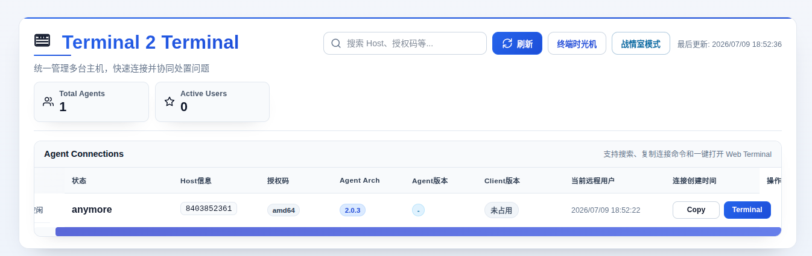
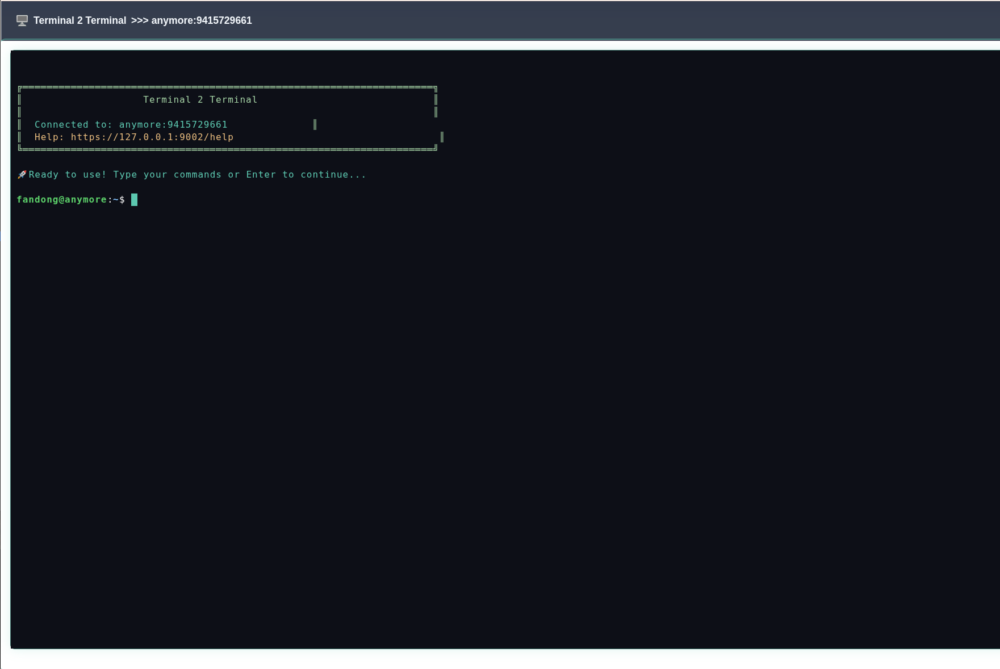
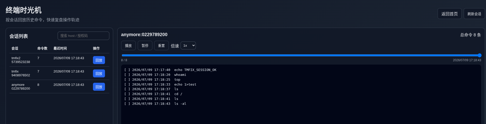
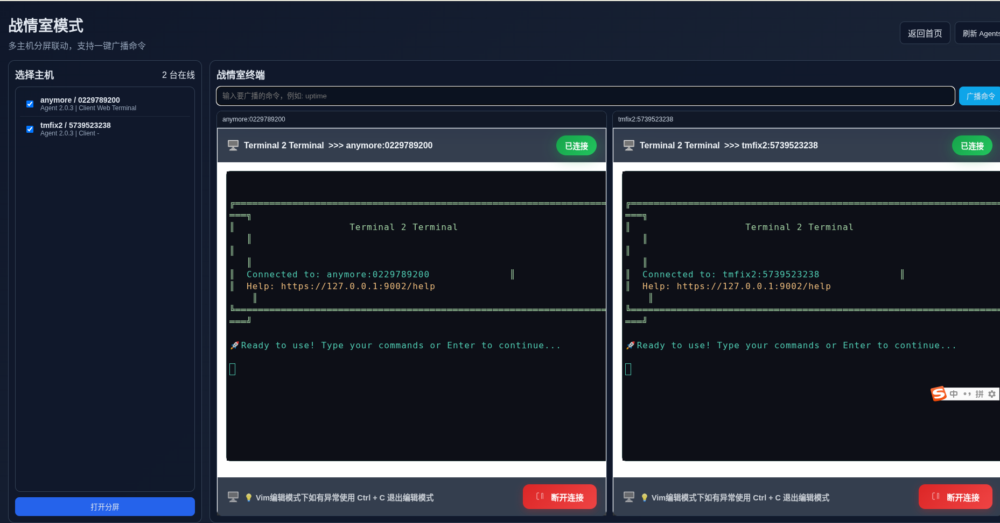

# t2t (Terminal 2 Terminal)

```
████████╗██████╗ ████████╗
╚══██╔══╝╚════██╗╚══██╔══╝
   ██║    █████╔╝   ██║
   ██║   ██╔═══╝    ██║
   ██║   ███████╗   ██║
   ╚═╝   ╚══════╝   ╚═╝
```

English documentation: [README.md](./README.md)

t2t 是一个面向运维与研发团队的远程终端管理工具，提供 `Agent + Server + Client/Web` 模式，支持多主机接入、多人协作连接、Web 终端访问以及会话回放能力。

项目目标：在保持部署轻量的前提下，提供清晰、可控、可审计的远程终端访问体验。

## 核心能力

- **多主机统一接入**：多个 Agent 同时在线，统一在 Server 侧管理
- **CLI + Web 双入口**：既支持命令行连接，也支持浏览器终端
- **多人协作访问**：支持同一目标主机多用户连接与操作
- **终端时光机（MVP）**：按会话查看命令时间线并回放
- **战情室模式（MVP）**：多主机分屏联动，支持广播命令

## 界面截图

### 控制台首页


### Web Terminal


### 终端时光机


### 战情室模式


## 架构说明

1. **Agent**
   - 部署在目标主机
   - 负责本地 Shell/PTY 与 Server 建立长连接

2. **Server**
   - 作为控制平面与转发中心
   - 处理 Agent 注册、Client/Web 附着、会话管理与页面/API 服务

3. **Client / Web**
   - Client：命令行快速连接
   - Web：可视化管理、浏览器终端、时光机和战情室

基础流程：
- Agent 启动后注册到 Server
- 用户在 Client/Web 发起连接请求
- Server 按 `hostTag + clientId` 路由到对应 Agent
- 建立双向数据转发，进行远程终端交互

## 快速开始

### 方式 A：Docker Compose（推荐）

环境要求：
- Docker
- Docker Compose v2

启动：

```bash
docker compose up -d --build
```

访问：
- 控制台：`http://localhost:9002`
- 默认本地账号：`admin / admin123`

常用命令：

```bash
# 查看日志
docker compose logs -f server
docker compose logs -f agent

# 停止并清理容器
docker compose down
```

说明：
- Compose 默认会启动 1 个 `server` 和 1 个 `agent`。
- `agent` 使用 `T2T_SERVER_HOST=server:9002`，可直接通过容器网络连接服务端。
- 终端时光机日志通过 `t2t_commands` 卷共享（路径 `/tmp/t2t/commands`）。

### 方式 B：手动构建运行

### 1) 环境要求

- Go 1.22+
- Linux/macOS（按实际部署环境选择）

### 2) 准备配置

使用 `cmd/server/config.yaml` 作为服务端配置模板：

```bash
cp cmd/server/config.yaml config.yaml
```

> 默认本地账号示例：`admin / admin123`。生产环境请务必修改。

### 3) 构建

```bash
go build -o build/t2t-server ./cmd/server
go build -o build/t2t-agent ./cmd/agent
go build -o build/t2t-client ./cmd/client
```

### 4) 启动服务

```bash
./build/t2t-server
```

### 5) 启动 Agent（在目标主机）

```bash
./build/t2t-agent
```

启动后会输出：
- `Host信息`
- `授权码`

### 6) 连接远程终端

```bash
./build/t2t-client connect -t <Host信息> -c <授权码>
```

或访问：
- `http://localhost:9002`

## 新增功能使用说明

### 终端时光机（MVP）

入口：首页按钮 **终端时光机**

功能：
- 会话列表查看
- 命令时间线回放（播放/暂停/倍速/拖动）
- 危险命令标记

当前实现说明（MVP）：
- 命令日志默认写入 `/tmp/t2t/commands`
- 时光机从该目录读取会话数据

### 战情室模式（MVP）

入口：首页按钮 **战情室模式**

功能：
- 勾选多台在线主机
- 分屏打开多个 Web 终端
- 广播同一命令到所有分屏终端

## 运维与安全建议

- 生产环境请修改默认账号和密码
- 建议在反向代理后启用 HTTPS
- 建议限制 Server 暴露范围（安全组/防火墙）
- 关注 `/tmp/t2t/commands` 日志留存策略（容量与清理）

## 常见问题

### 为什么时光机没有 session？

请检查：
- Agent 是否为最新版本并已重启
- 是否确实执行过命令
- `/tmp/t2t/commands/commands_<hostTag>_<clientId>.json` 是否生成

## Contributing

欢迎提交 Issue 与 PR。建议在提交前执行：

```bash
go test ./...
```
